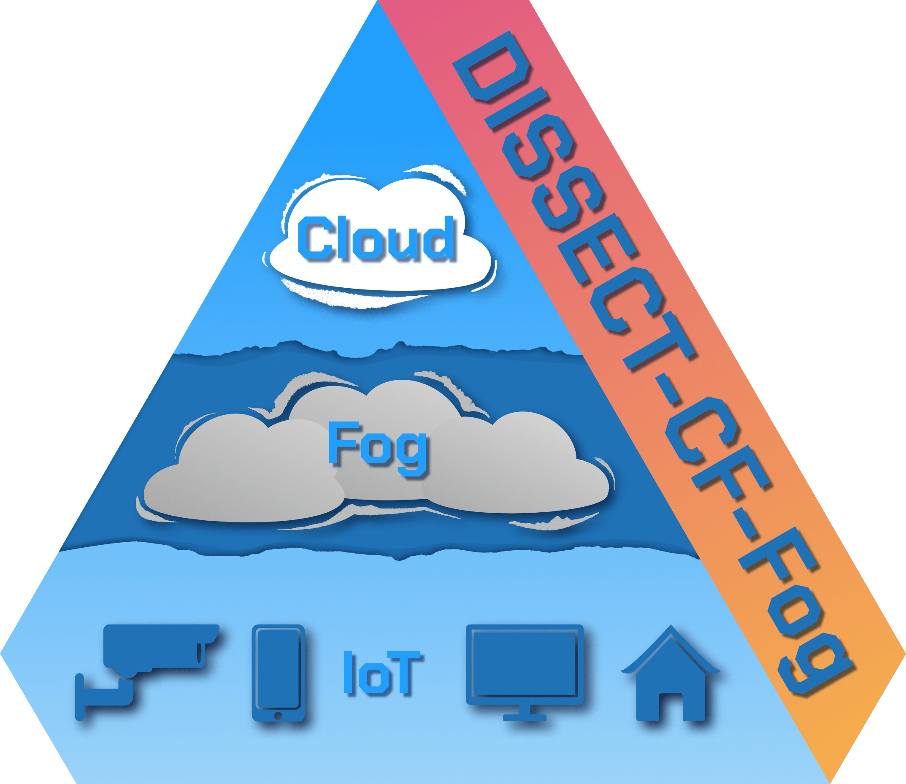

# DISSECT-CF-Fog Tutorial / Documentation GitHub Page

    

This branch constains the [GitHub Page] for an introductory tutorial for the [DISSECT-CF-Fog] Simulator.

#### The website's URL: https://sed-inf-u-szeged.github.io/DISSECT-CF-Fog

- this site is currently under development, feedback is appreciated;

- this site uses the [Just the Docs] theme;

[Just the Docs]: https://just-the-docs.github.io/just-the-docs/
[DISSECT-CF-Fog]: https://github.com/sed-inf-u-szeged/DISSECT-CF-Fog/
[GitHub Page]: https://docs.github.com/en/pages/
