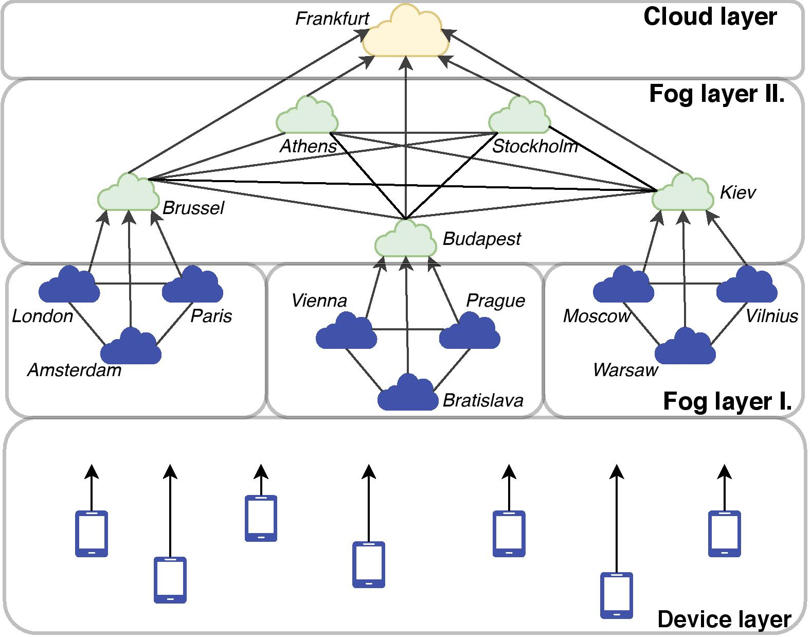

# Fog Simulation Example
{: .no_toc }

## Table of contents
{: .no_toc .text-delta }

- TOC
{:toc}

---

## [IoT-Fog-Cloud Architecture]{:target="_blank"}

The **IoT–Fog–Cloud architecture** is a hierarchical model that extends traditional cloud computing by introducing intermediate
processing layers closer to data sources. Its goal is to reduce latency, lower bandwidth usage, and enable faster decision-making.

The architecture consists of three main layers:
- **Edge Layer** – where IoT devices generate data
- **Fog Layer** – performs intermediate, near-device processing
- **Cloud Layer** – handles centralized storage and large-scale analytics

Unlike a cloud-only model, where all data is sent directly to remote data centers, this approach distributes computation across the network. 
Time-sensitive tasks can be handled closer to the devices, while more complex processing remains in the cloud.

This concept is commonly referred to as Fog Computing, as it extends cloud capabilities toward the edge of the network. 
The term Edge Computing is closely related and often overlaps, generally emphasizing computation performed directly on or near the devices themselves.


{: .text-center}

---

## [Mobile Edge Computing]{:target="_blank"}

In many real-world IoT scenarios, devices are not stationary but **mobile**. This introduces additional challenges such as 
**changing network conditions**, varying latency, and **dynamic connectivity** to nearby nodes.

**Mobile Edge Computing** (MEC) extends the edge/fog concept by supporting computation for moving 
devices. Instead of relying on a fixed processing node, devices may:
- connect to different fog or edge nodes over time,
- **migrate** their workloads between nodes,
- or experience **changes** in latency and bandwidth **depending on their location**.

This makes mobility an important factor in system design, as applications must adapt to a constantly changing environment.

In the context of this simulator, mobility is modeled explicitly, allowing devices to move and dynamically interact with different nodes in the infrastructure.


---


## Example

With our newly acquired knowledge, we can examine a simulation [example]{:target="_blank"} that uses **fog nodes** and **edge devices**.

```java
package hu.u_szeged.inf.fog.simulator.demo.simple;

import hu.mta.sztaki.lpds.cloud.simulator.Timed;
import hu.mta.sztaki.lpds.cloud.simulator.energy.powermodelling.PowerState;
import hu.mta.sztaki.lpds.cloud.simulator.iaas.PhysicalMachine;
import hu.mta.sztaki.lpds.cloud.simulator.iaas.constraints.AlterableResourceConstraints;
import hu.mta.sztaki.lpds.cloud.simulator.io.Repository;
import hu.mta.sztaki.lpds.cloud.simulator.io.VirtualAppliance;
import hu.mta.sztaki.lpds.cloud.simulator.util.PowerTransitionGenerator;
import hu.mta.sztaki.lpds.cloud.simulator.util.SeedSyncer;
import hu.u_szeged.inf.fog.simulator.application.Application;
import hu.u_szeged.inf.fog.simulator.application.strategy.RuntimeAwareApplicationStrategy;
import hu.u_szeged.inf.fog.simulator.demo.ScenarioBase;
import hu.u_szeged.inf.fog.simulator.iot.Device;
import hu.u_szeged.inf.fog.simulator.iot.EdgeDevice;
import hu.u_szeged.inf.fog.simulator.iot.SmartDevice;
import hu.u_szeged.inf.fog.simulator.iot.mobility.GeoLocation;
import hu.u_szeged.inf.fog.simulator.iot.mobility.RandomWalkMobilityStrategy;
import hu.u_szeged.inf.fog.simulator.iot.strategy.RandomDeviceStrategy;
import hu.u_szeged.inf.fog.simulator.node.ComputingAppliance;
import hu.u_szeged.inf.fog.simulator.provider.Instance;
import hu.u_szeged.inf.fog.simulator.util.EnergyDataCollector;
import hu.u_szeged.inf.fog.simulator.util.MapVisualiser;
import hu.u_szeged.inf.fog.simulator.util.SimLogger;
import hu.u_szeged.inf.fog.simulator.util.TimelineVisualiser;
import java.util.*;

public class FogSimulationExample {

    public static void main(String[] args) throws Exception {
        SimLogger.setLogging(1, true);

        String cloudfile = ScenarioBase.resourcePath + "LPDS_original.xml";

        VirtualAppliance va = new VirtualAppliance("va", 100, 0, false, 1_073_741_824L);
        AlterableResourceConstraints arc = new AlterableResourceConstraints(2, 0.001, 4_294_967_296L);

        ComputingAppliance cloud1 = new ComputingAppliance(cloudfile, "cloud1", new GeoLocation(47.45, 21.3), 100);
        ComputingAppliance fog1 = new ComputingAppliance(cloudfile, "fog1", new GeoLocation(47.6, 17.9), 50);
        ComputingAppliance fog2 = new ComputingAppliance(cloudfile, "fog2", new GeoLocation(46.0, 18.2), 50);

        new EnergyDataCollector("cloud1", cloud1.iaas, true);
        new EnergyDataCollector("fog1", fog1.iaas, true);
        new EnergyDataCollector("fog2", fog2.iaas, true);
        
        fog1.setParent(cloud1, 77);
        fog2.setParent(cloud1, 80);
        
        fog1.addNeighbor(fog2, 33);

        Instance instance1 = new Instance("instance1", va, arc, 0.0255 / 60 / 60 / 1000);
        Instance instance2 = new Instance("instance2", va, arc, 0.051 / 60 / 60 / 1000);
        Instance instance3 = new Instance("instance3", va, arc, 0.102 / 60 / 60 / 1000);

        Application application1 = new Application("App-1", 1 * 60 * 1000, 250, 2_500, false,
                new RuntimeAwareApplicationStrategy(0.9, 2.0), instance3);
        Application application2 = new Application("App-2", 1 * 60 * 1000, 250, 2_500, true,
                new RuntimeAwareApplicationStrategy(0.9, 2.0), instance2);
        Application application3 = new Application("App-3", 1 * 60 * 1000, 250, 2_500, true,
                new RuntimeAwareApplicationStrategy(0.9, 2.0), instance1);

        cloud1.addApplication(application1);
        fog1.addApplication(application2);
        fog2.addApplication(application3);

        ArrayList<Device> deviceList = new ArrayList<Device>();
        for (int i = 0; i < 10; i++) {
            HashMap<String, Integer> latencyMap = new HashMap<String, Integer>();
            EnumMap<PowerTransitionGenerator.PowerStateKind, Map<String, PowerState>> transitions = 
                    PowerTransitionGenerator.generateTransitions(0.065, 1.475, 2.0, 1, 2);

            final Map<String, PowerState> cpuTransitions = transitions.get(PowerTransitionGenerator.PowerStateKind.host);
            final Map<String, PowerState> stTransitions = transitions.get(PowerTransitionGenerator.PowerStateKind.storage);
            final Map<String, PowerState> nwTransitions = transitions.get(PowerTransitionGenerator.PowerStateKind.network);

            Repository repo = new Repository(4_294_967_296L, "mc-repo" + i, 3250, 3250, 3250, latencyMap, stTransitions, nwTransitions); // 26 Mbit/s
            PhysicalMachine localMachine = new PhysicalMachine(2, 0.001, 2_147_483_648L, repo, 0, 0, cpuTransitions);

            Device device;
            double step = SeedSyncer.centralRnd.nextDouble(); 
            if (i % 2 == 0) {
                device = new EdgeDevice(0, 10 * 60 * 60 * 1000, 100, 60 * 1000, 
                        new RandomWalkMobilityStrategy(new GeoLocation(47 + step, 19 - step), 0.0027, 0.0055, 10_000),
                        new RandomDeviceStrategy(), localMachine, 0.1, 50, true);
            } else {
                device  = new SmartDevice(0, 10 * 60 * 60 * 1000, 100, 60 * 1000, 
                        new RandomWalkMobilityStrategy(new GeoLocation(47 - step, 19 - step), 0.0027, 0.0055, 10_000),
                        new RandomDeviceStrategy(), localMachine, 50, true);
            }
            deviceList.add(device);
        }

        long starttime = System.nanoTime();
        Timed.simulateUntilLastEvent();
        long stoptime = System.nanoTime();

        ScenarioBase.calculateIoTCost();
        ScenarioBase.logBatchProcessing(stoptime - starttime);
        TimelineVisualiser.generateTimeline(ScenarioBase.resultDirectory);
        MapVisualiser.mapGenerator(ScenarioBase.scriptPath, ScenarioBase.resultDirectory, deviceList);
        EnergyDataCollector.writeToFile(ScenarioBase.resultDirectory);
    }
}
```

If we inspect the code, we can see that it is very similar to the [IoT Simulation Example](iot_example#example).

### Key differences:
{: .no_toc}
- The [SimLogger's](iot_example#simlogger) second parameter is set to true, meaning logs are written to a file in addition to being printed to the console.
- We create three ComputingAppliance instances:
  - one represents the cloud,
  - two represent fog nodes and to configure them as fog nodes, we use the previously introduced
    [`setParent`](iot_example#setparent) and [`addNeighbor`](iot_example#addneighbor) methods to define their relationships.
  - Unlike the previous example, these nodes now have finite ranges, which affects how they work and how they look on the map.

- The rest of the setup remains mostly unchanged (aside from parameter differences, such as using a different application strategy) until we reach device creation.

---

### Devices and mobility:
{: .no_toc}
  - Devices are now placed within or near the range of the cloud and fog nodes, not all over the world.
  - To achieve reproducible positioning, we use the **[SeedSyncer]** utility:
    - this ensures that device positions remain the same across multiple runs,
    - unlike the previous example where positions were fully random.
  - We also introduce both device types:
    - 5 **EdgeDevices** – capable of local processing
    - 5 **SmartDevices** – send all data to the infrastructure


---

### Output differences:
{: .no_toc}

Let’s examine how these changes affect the outputs:
- An additional log file is generated due to file logging being enabled.
- In the logs:
  - some devices now appear performing processing tasks, not only cloud VMs, but also EdgeDevices contribute to computation.
  - This is also visible in the timeline, where device-side processing appears alongside application activity.

### Generated files
{: .no_toc}

- **energy.csv**
  - Now includes additional entries for the fog nodes’ energy consumption.
- **devicePaths**
  - Contains multiple position entries over time, since devices now use a mobility strategy instead of remaining static.
- **map.html**
  - New thing we can see now:
    - connections between computing nodes (including latency),
    - their coverage ranges,
    - and device movement paths.
  - Unlike the previous example, the visualization is clearer due to finite node ranges instead of infinite coverage.

---

With these additions, the simulation becomes significantly more realistic.
We now have a system where computation can occur at multiple levels (edge, fog, cloud), and where device mobility influences system behavior.

At this point, you should have a **solid understanding** of the **fundamentals** and be ready to **build your own** IoT–Fog–Cloud **simulations**.


[example]: https://github.com/sed-inf-u-szeged/DISSECT-CF-Fog/blob/master/simulator/src/main/java/hu/u_szeged/inf/fog/simulator/demo/simple/FogSimulationExample.java
[IoT-Fog-Cloud Architecture]: https://en.wikipedia.org/wiki/Fog_computing
[Mobile Edge Computing]: https://en.wikipedia.org/wiki/Multi-access_edge_computing
[SeedSyncer]: https://github.com/sed-inf-u-szeged/DISSECT-CF-Fog/blob/master/simulator/src/main/java/hu/mta/sztaki/lpds/cloud/simulator/util/SeedSyncer.java