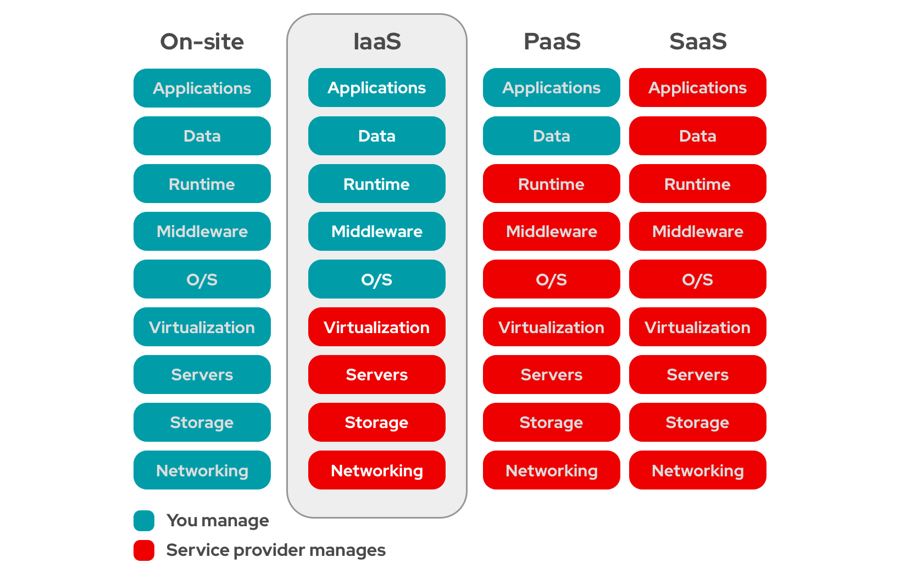

# IaaS Service Example
{: .no_toc }

## Table of contents
{: .no_toc .text-delta }

- TOC
{:toc}

---

## Infrastructure as a Service

**Infrastructure as a Service** (IaaS) is a cloud computing model that **provides** virtualized resources such as **virtual machines, storage, and networking**.
Although cloud systems are often divided into IaaS, PaaS, and SaaS layers, this simulator - and specifically this example - focuses only on the IaaS level.


{: .text-center}

As a result, we will work directly with components like physical machines, virtual machines, repositories, and resource constraints, just like before.
However, unlike in the previous example - where we manually created VMs on our PM - we now delegate this task to the **[IaaSService]{:target="_blank"}** class, which manages its own PMs and handles the scheduling of VM requests.

Just like a real IaaS service.

## [IaaSService]{:target="_blank"}

This class represents a single IaaS service. Its tasks include the maintenance and management of the physical machines, as well as the scheduling of the VM requests among them.

To use this class effectively, we need to be familiar with the following functions:

#### `IaaSService - constructor`
{: .text-beta}

```java
public IaaSService(Class<? extends Scheduler> s, Class<? extends PhysicalMachineController> c){...}
```

**Description:**  
Constructs an IaaS service object directly. The VM and PM schedulers for this IaaS service will be created during the creation of the IaaSService itself.
This ensures that users cannot alter the link between the IaaSService and the various schedulers.

**Parameters:**
- `s` - class of the VM scheduler to be used. These are classes that inherited the [Scheduler]{:target="_blank"} class.
- `c` - class of the PM scheduler to be used. These are classes that inherited the [PhysicalMachineController]{:target="_blank"} class.

----------------

#### `requestVM`
{: .text-beta}

```java
public VirtualMachine[] requestVM(final VirtualAppliance va, final ResourceConstraints rc,
			final Repository vaSource, final int count)
```

**Description:**  
Allows the request of multiple VMs without propagating any scheduling constraints.  
Same use case as the PM's [requestVM](vm#requestvm).

**Parameters:**
- `va` - the VA to be used as the disk of the VM.
- `rc` - the resource requirements of the future VM.
- `vaSource` - the repository that currently stores the VA.
- `count` - the number of VMs that this request should be returning with.

**Return:**
The virtual machine(s) that will be instantiated by the call.


----------------


#### `registerHost`
{: .text-beta}

```java
public void registerHost(final PhysicalMachine pm) {...}
```

**Description:**  
This function allows the IaaS to grow in size with a single PM.

**Parameters:**
- `pm` - the new physical machine to be utilized within the system.


----------------


#### `registerRepository`
{: .text-beta}

```java
public void registerRepository(final Repository r) {...}
```

**Description:**  
This function allows the IaaS to grow its storage capacities.

**Parameters:**
- `r` - the new repository to be utilized within the system.


----------------

## Example

Now that we know how to set up a IaaSService for the simulation, let's look at its usage through an actual [example]{:target="_blank"}.

```java
package hu.u_szeged.inf.fog.simulator.demo.simple;
import hu.mta.sztaki.lpds.cloud.simulator.Timed;
import hu.mta.sztaki.lpds.cloud.simulator.energy.powermodelling.PowerState;
import hu.mta.sztaki.lpds.cloud.simulator.iaas.IaaSService;
import hu.mta.sztaki.lpds.cloud.simulator.iaas.PhysicalMachine;
import hu.mta.sztaki.lpds.cloud.simulator.iaas.VMManager.VMManagementException;
import hu.mta.sztaki.lpds.cloud.simulator.iaas.VirtualMachine;
import hu.mta.sztaki.lpds.cloud.simulator.iaas.constraints.AlterableResourceConstraints;
import hu.mta.sztaki.lpds.cloud.simulator.iaas.pmscheduling.AlwaysOnMachines;
import hu.mta.sztaki.lpds.cloud.simulator.iaas.vmscheduling.FirstFitScheduler;
import hu.mta.sztaki.lpds.cloud.simulator.io.Repository;
import hu.mta.sztaki.lpds.cloud.simulator.io.StorageObject;
import hu.mta.sztaki.lpds.cloud.simulator.io.VirtualAppliance;
import hu.mta.sztaki.lpds.cloud.simulator.util.PowerTransitionGenerator;
import java.lang.reflect.InvocationTargetException;
import java.util.EnumMap;
import java.util.HashMap;
import java.util.Map;

public class IaaSServiceExample {
    public static void main(String[] args) {
        try {
            
            IaaSService iaas = new IaaSService(FirstFitScheduler.class, AlwaysOnMachines.class);
            
            // machines
            final EnumMap<PowerTransitionGenerator.PowerStateKind, Map<String, PowerState>> transitions =
                    PowerTransitionGenerator.generateTransitions(20, 200, 300, 10, 20);
            
            Repository pmRepo1 = new Repository(107_374_182_400L, "pmRepo1", 12_500, 12_500, 12_500, new HashMap<>(), 
                    transitions.get(PowerTransitionGenerator.PowerStateKind.storage),
                    transitions.get(PowerTransitionGenerator.PowerStateKind.network));

            PhysicalMachine pm1 = new PhysicalMachine(8, 1, 8_589_934_592L, pmRepo1, 10_000, 10_000, 
                    transitions.get(PowerTransitionGenerator.PowerStateKind.host));
            
            Repository pmRepo2 = new Repository(107_374_182_400L, "pmRepo2", 12_500, 12_500, 12_500, new HashMap<>(), 
                    transitions.get(PowerTransitionGenerator.PowerStateKind.storage),
                    transitions.get(PowerTransitionGenerator.PowerStateKind.network));

            PhysicalMachine pm2 = new PhysicalMachine(8, 1, 8_589_934_592L, pmRepo2, 10_000, 10_000, 
                    transitions.get(PowerTransitionGenerator.PowerStateKind.host));
            
            iaas.registerHost(pm1);
            iaas.registerHost(pm2);
            
            // repositories
            Repository cloudRepo = new Repository(107_374_182_400L, "cloudRepo", 12_500, 12_500, 12_500, new HashMap<>(), 
                    transitions.get(PowerTransitionGenerator.PowerStateKind.storage),
                    transitions.get(PowerTransitionGenerator.PowerStateKind.network));
            
            iaas.registerRepository(cloudRepo);
            
            cloudRepo.addLatencies("pmRepo1", 100);
            cloudRepo.addLatencies("pmRepo2", 125);

            // VMs
            VirtualAppliance va = new VirtualAppliance("ubuntu", 1000, 0, false, 1_073_741_824L);
            
            AlterableResourceConstraints arc = new AlterableResourceConstraints(4, 1, 4_294_967_296L);
            
            iaas.repositories.get(0).registerObject(va);
            
            iaas.requestVM(va, arc, iaas.repositories.get(0), 3);

            Timed.simulateUntilLastEvent();

            // logging
            System.out.println("Time: " + Timed.getFireCount());
            
            for(PhysicalMachine pm : iaas.machines) {
                System.out.println(pm);
                for(VirtualMachine vm : pm.listVMs()) {
                    System.out.println("\t" + vm);
                }
                for(StorageObject content : pm.localDisk.contents()) {
                    System.out.println("\t" + content);
                }
            }
            for(Repository r : iaas.repositories) {
                System.out.println(r);
                for(StorageObject content : r.contents()) {
                    System.out.println("\t" + content);
                }
            }
        } catch (InstantiationException | IllegalAccessException | IllegalArgumentException | InvocationTargetException
                | NoSuchMethodException | SecurityException | VMManagementException e) {
            e.printStackTrace();
        }
    }
}
```

At first glance, this example is very similar to the [previous example](vm#example).

Let’s take a look at the differences:
- Right at the beginning we [instantiate](#iaasservice---constructor) an IaaSService.
  We use the [FirstFitScheduler]{:target="_blank"} class for VM scheduling and the [AlwaysOnMachines]{:target="_blank"} class for PM control.
- We create PhysicalMachines just like in the previous example. The difference is that we register them using the [registerHost](#registerhost) function, making them available to the IaaSService.
- We create a cloud storage for the IaaSService and attach it using the [registerRepository](#registerrepository) function.
- Finally, we set up the VMs just as before, except that [requestVM](#requestvm) is now called on the IaaSService instead of directly on the PMs, since the service manages those machines.
  - This time, instead of one VM, we request three to better demonstrate cloud-like behavior.
- We can use the usual [simulateUntilLastEvent](time#simulateuntillastevent) call to run the simulation.

If we run the program, the output should look like this:

```text
Time: 268799
Machine(S:RUNNING C:0.0 M:0 Repo(DS:107374182400 Used:2147483648 NetworkNode(Id:pmRepo1 NI:12500,NO:12500 -- RX:2.147483648E9 TX:0.0 --, D:12500)) MaxMinProvider(Hash-6 RS(processing: [] in power state: PowSt(I: 200.0 C: 100.0 hu.mta.sztaki.lpds.cloud.simulator.energy.powermodelling.LinearConsumptionModel))))
	VM(RUNNING RA(Canc:false ResourceConstraints(C:4.0 P:1.0 M:4294967296)) MaxMinConsumer(Hash-22 RS(processing: [] in power state: -)))
	VM(RUNNING RA(Canc:false ResourceConstraints(C:4.0 P:1.0 M:4294967296)) MaxMinConsumer(Hash-23 RS(processing: [] in power state: -)))
	VA(SO(id:VMDisk-of-23 size:1073741824) sp:1000.0 bgnl:0)
	VA(SO(id:VMDisk-of-22 size:1073741824) sp:1000.0 bgnl:0)
Machine(S:RUNNING C:4.0 M:4294967296 Repo(DS:107374182400 Used:1073741824 NetworkNode(Id:pmRepo2 NI:12500,NO:12500 -- RX:1.073741824E9 TX:0.0 --, D:12500)) MaxMinProvider(Hash-14 RS(processing: [] in power state: PowSt(I: 200.0 C: 100.0 hu.mta.sztaki.lpds.cloud.simulator.energy.powermodelling.LinearConsumptionModel))))
	VM(RUNNING RA(Canc:false ResourceConstraints(C:4.0 P:1.0 M:4294967296)) MaxMinConsumer(Hash-24 RS(processing: [] in power state: -)))
	VA(SO(id:VMDisk-of-24 size:1073741824) sp:1000.0 bgnl:0)
Repo(DS:107374182400 Used:1073741824 NetworkNode(Id:cloudRepo NI:12500,NO:12500 -- RX:0.0 TX:3.221225472E9 --, D:12500))
	VA(SO(id:ubuntu size:1073741824) sp:1000.0 bgnl:0)

Process finished with exit code 0
```

Considering the similarities between the examples - and the fact that the main difference lies in the architecture - the output reflects what we achieved in this setup.
- We print the time after the simulation ends, which represents the point when all requested VMs are running.
- We list the machines managed by the IaaSService:
  - We can see their running VMs and storage:
    - The first PM hosts 2 VMs, while the second hosts 1. This is because the defined ARC which uses exactly half of a PM’s original resources, allowing at most two VMs to fit on one machine.
    - We can also observe that each repository contains a copy of the 1 GB VM image.
- Finally, we print the IaaSService’s repository (the cloud storage), which contains the original image file registered with the "ubuntu" identifier.

---

Slowly, we are starting to build simulations that can model real-world systems.


[IaaSService]: https://github.com/sed-inf-u-szeged/DISSECT-CF-Fog/blob/master/simulator/src/main/java/hu/mta/sztaki/lpds/cloud/simulator/iaas/IaaSService.java
[Scheduler]: https://github.com/sed-inf-u-szeged/DISSECT-CF-Fog/blob/master/simulator/src/main/java/hu/mta/sztaki/lpds/cloud/simulator/iaas/vmscheduling/Scheduler.java
[PhysicalMachineController]: https://github.com/sed-inf-u-szeged/DISSECT-CF-Fog/blob/master/simulator/src/main/java/hu/mta/sztaki/lpds/cloud/simulator/iaas/pmscheduling/PhysicalMachineController.java
[example]: https://github.com/sed-inf-u-szeged/DISSECT-CF-Fog/blob/master/simulator/src/main/java/hu/u_szeged/inf/fog/simulator/demo/simple/IaaSServiceExample.java
[FirstFitScheduler]: https://github.com/sed-inf-u-szeged/DISSECT-CF-Fog/blob/master/simulator/src/main/java/hu/mta/sztaki/lpds/cloud/simulator/iaas/vmscheduling/FirstFitScheduler.java
[AlwaysOnMachines]: https://github.com/sed-inf-u-szeged/DISSECT-CF-Fog/blob/master/simulator/src/main/java/hu/mta/sztaki/lpds/cloud/simulator/iaas/pmscheduling/AlwaysOnMachines.java