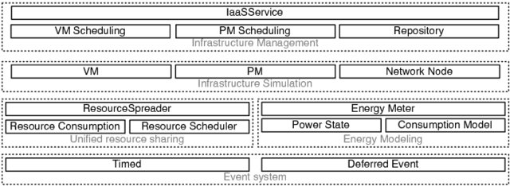

# Introduction

---

## What is DISSECT-CF-Fog?

**DISSECT-CF-Fog** is an open source, **discrete-event-based simulator** mostly written in Java, and is built
on top of the original **[DISSECT-CF](https://github.com/kecskemeti/dissect-cf){:target="_blank"}**.

**DISSECT-CF** is an infrastructure cloud simulator. It was designed for research purposes, so researchers could experiment with
various internal cloud behavior changes without the need to actually have one or even multiple cloud infrastructures at hand.

**DISSECT-CF-Fog** extends this simulator, making it possible to simulate the **IoT–Fog–Cloud**
architecture and investigate things like trade-offs of offloading algorithms and other related scenarios.

For more details check out the current **[DISSECT-CF-Fog](https://github.com/sed-inf-u-szeged/DISSECT-CF-Fog){:target="_blank"}** GitHub repository.

---

## What will be in this section?

As previously said DISSECT-CF-Fog builds onto DISSECT-CF. Therefore, most of the **basic components** come from the original simulator.

Since DISSECT-CF-Fog simulates **fogs** and **(mobile) edge devices** as fundamental elements of the system, they will be also covered in the basics section.

{: .text-center}

{: .note }
**DISSECT-CF:** **DIS**crete event ba**S**ed **E**nergy **C**onsumption simula**T**or for **C**louds and **F**ederations
