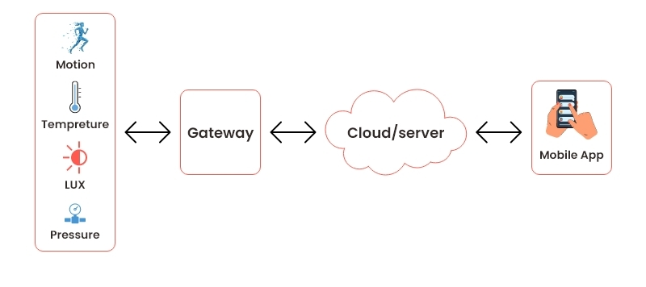

# IoT Simulation Example
{: .no_toc }

## Table of contents
{: .no_toc .text-delta }

- TOC
{:toc}

---

## [Internet of Things]{:target="_blank"}

The [Internet of Things]{:target="_blank"} (IoT) refers to physical objects that are embedded with sensors, processing capabilities,
software, and other technologies, enabling them to connect and exchange data with other devices and systems over
the Internet or other communication networks.

This simulator is capable of modeling such systems. At a basic level, these systems are composed of:
- **IoT devices** (sensors, smart devices, etc.), which generate the data to be processed;
- **Clouds**, which store, process, and analyze this data;
- **Applications**, which request and use the processed data to provide services.


{: .text-center}


---


## Utility classes

{: .note }
These classes will not be covered in detail, as only a few of their methods are used in this example.
As their names suggest, they provide utility functionality such as creating maps, generating CSV files,
and producing console output, allowing us to observe and analyze the simulation.


### [ScenarioBase]{:target="_blank"}

This class acts as a helper for IoT simulation scenarios, providing functionality for initializing required components
(such as cloud providers), managing common configuration paths, and logging detailed simulation results.
It aggregates metrics like cost, energy consumption, data volume, and system activity,
making it easier to analyze and compare different simulation runs.

The most used elements from this class will be its "path" variables, as well as
the `calculateIoTCost` and the `logBatchProcessing` methods, more on those [later](#example).

{: .note}
This is not a “core simulation class” - it’s: *a support/utility class for scenario execution and evaluation*.
That’s why it feels messy - it’s intentionally a central helper.


----------------


### [SimLogger]{:target="_blank"}

Provides logging functionality for the simulation. Log messages are defined throughout the framework,
so you only need to configure logging at the start of the simulation.

```java
SimLogger.setLogging(1, false);
```
- The first parameter specifies the log level:
  - 0 - logging disabled
  - 1 - full logging (all messages are printed)
  - 2 - partial logging (only results are shown)
- The second parameter determines whether logs should also be written to a file.


----------------


### [EnergyDataCollector]{:target="_blank"}

This is the previously [mentioned](repository#repository-1) energy data collector specific to DISSECT-CF-Fog.

It is used to monitor energy consumption of either an [IaaSService](iaas#iaasservice) or a [Physical Machine](vm#physicalmachine).
The IaaSService or Physical Machine must be given during initialization via one of the constructors:

```java
public EnergyDataCollector(String name, IaaSService iaas, boolean logging) {...}
public EnergyDataCollector(String name, PhysicalMachine pm, boolean logging) {...}
```
**Parameters:**
- `name` - identifier of the monitored entity.
- `iaas` / `pm` - the IaaSService or PhysicalMachine instance being monitored.
- `logging` - enables or disables logging (true / false).

To write the collected energy data to a file, use the `EnergyDataCollector.writeToFile()` method.

{: .note}
The class keeps track and manages all EnergyDataCollector instances, so you only need to create them.
This also means the collected data represents an aggregate of every energy-consuming
component in the simulation, so keep that in mind when using it.


----------------


### [TimelineVisualiser]{:target="_blank"}

Provides functionality to generate a timeline visualization in HTML format that presents main simulation events.
To do that we will use its `generateTimeline` method.


----------------


### [MapVisualiser]{:target="_blank"}

Provides functionality to generate a map visualization in HTML format that presents the position of computing appliances and device paths.
To do that we will use one of its `mapGenerator` method.


----------------


## IoT classes

These classes are essential for building IoT-related simulations, so understanding their basic functionality is important.
They will be used in the upcoming example, as well as in the [Fog Simulation Example](fog_example) in the next chapter.


### [Instance]{:target="_blank"}
This class represents a VM type, including its pricing, image, and flavor characteristics. Essentially, it acts as a template for creating VMs.
- Flavor – the hardware specifications, defined by AlterableResourceConstraints.
- Image – the VirtualAppliance, similar to what is used to make a regular VM.
- Pricing – the cost of running the VM.

#### `Instance - constructor`
{: .no_toc .text-beta }

```java
public Instance(String name, VirtualAppliance va, AlterableResourceConstraints arc, double pricePerTick){...}
```

**Description:**  
Constructs an instance type with the specified name, virtual appliance, resource constraints, and cost per tick.

{: .note}
The class has other constructors, but those won't be covered here.

**Parameters:**
- `name` - the name of the instance.
- `va` - the VM image file associated with the instance.
- `arc` - the resource requirement of the instance.
- `pricePerTick` - the cost of the instance per tick (in ms).


----------------


### [Application]{:target="_blank"}
This class is an abstract representation of an IoT application. It receives data
from IoT devices, which are then processed by virtual machines (initialized on the
[physical architecture](#computingappliance)) in the form of computational tasks.

An application only begins processing tasks when a so-called broker (service) - represented by a VM - is already running.

{: .note}
In the current implementation, one virtual machine is capable of processing one task at a time.  
This class also handles decisions related to VM scaling and data offloading (load balancing).  
The class is responsible for batch-processing, as it extends the Timed class: it will handle IoT data only at certain intervals (according to its frequency).

#### `Application - constructor`
{: .no_toc .text-beta }

```java
public Application(String name, long freq, long tasksize, double instructions, boolean serviceable,
                   ApplicationStrategy applicationStrategy, Instance instance) {...}
```

**Description:**  
Constructs a new Application with the specified parameters.

**Parameters:**
- `name` - the name of the application.
- `freq` - the frequency of the periodic task execution (time interval in ms).
- `tasksize` - the max size of a task (in bytes).
- `instructions` - the number of instructions that a task with max size can represent.
- `serviceable` - indicates whether the application is able to receive data from IoT devices.
- `applicationStrategy` - the logic for finding another application in case of offloading.
- `instance` - the type of the VMs used by this application.


----------------


### [ComputingAppliance]{:target="_blank"}
This component represents the physical resources (fog and cloud nodes) in the system.
They also defines the connection between distinct computing nodes, thus the connected
physical machines form a hierarchical structure. This representation fits the batch processing-based evaluation.

#### `ComputingAppliance - constructor`
{: .text-beta}

```java
public ComputingAppliance(String file, String name, GeoLocation geoLocation, long range) {...}
```

**Description:**  
Constructs a new ComputingAppliance with the specified parameters. It also starts the energy measurement for this instance.

{: .note}
The class has other constructors, but those won't be covered here.

**Parameters:**
- `file` - the file path defining an IaaSService.
- `name` - the name of the computing appliance.
- `geoLocation` - the geographical location of the computing appliance, it's given with a [GeoLocation]{:target="_blank"} class.
- `range` - the range of the computing appliance in km (0 or smaller means infinite range).

----------------

#### `addApplication`
{: .text-beta}

```java
public void addApplication(Application... applications) {...}
```

**Description:**  
It adds ('deploys') one or more applications to the computing appliance.
If the computing appliance has no broker (no cloud VM instance) configured, it starts the broker.

**Parameters:**
- `applications` - one or more applications to add.


----------------

There is two other methods we won't use in the current example, but we will in the next one.
Considering it's a core part of ComputingAppliance we cover them here briefly, and see their usage [later](fog_example#example).

#### `setParent`
{: .text-beta}

```java
public void setParent(ComputingAppliance parent, int latency) {...}
```

**Description:**  
Sets the parent computing appliance of this computing appliance with the specified latency.
(Will be used to define relations between fogs and clouds.)

**Parameters:**
- `parent` - the parent computing appliance to set
- `latency` - the latency between this computing appliance and its parent


----------------

#### `addNeighbor`
{: .text-beta}

```java
public void addNeighbor(ComputingAppliance that, int latency) {...}
```

**Description:**  
Adds a neighboring computing appliance with the specified latency.

**Parameters:**
- `that` - the computing appliance to add as a neighbor.
- `latency` - the latency between this computing appliance and the neighbor.


----------------


Lastly we have to talk about the IoT Devices we can model in DISSECT-CF-Fog.


## [Device]{:target="_blank"}
This class is an abstract representation of an IoT device that is capable of generating data within a
certain time interval and then forwarding it to a cloud or fog node.

There are currently two implementations: [SmartDevice] and [EdgeDevice].


### [SmartDevice]{:target="_blank"}
With this implementation, simple but mobility-enabled IoT devices can be created.

{: .note}
The device is not capable of local data processing, so a certain time
after the last data generation, if the local storage is still not empty,
the data is considered as stuck. This is necessary to avoid endless
running of the simulation.  
So when creating a scenario, make sure that the position of the moving device is (at least temporarily) covered by a node.

#### `SmartDevice - constructor`
{: .text-beta}

```java
public SmartDevice(long startTime, long stopTime, long fileSize, long freq,
                   MobilityStrategy mobilityStrategy, DeviceStrategy deviceStrategy, 
                   PhysicalMachine localMachine, int latency, boolean pathLogging) {...}
```

**Description:**  
Defines a new smart device.

{: .note}
To avoid a completely periodic behavior, a random value between 0-3 minutes is added to the initial start time of the device.

**Parameters:**
- `startTime` - the time when the device starts generating data (ms).
- `stopTime` - the time when the device stops generating data (ms).
- `fileSize` - the size of the generated data (byte).
- `freq` - the time interval between two data measurement (ms).
- `mobilityStrategy` - the strategy that defines the route of the device.
- `deviceStrategy` - the strategy that defines to which IoT application this device connect.
- `localMachine` - the physical machine for networking and storing.
- `latency` - the minimum latency of data sending (ms).
- `pathLogging` - true if the route of the device needs to be logged.

----------------


### [EdgeDevice]{:target="_blank"}
The EdgeDevice class represents a device at the edge of a network, more on that [later](fog_example).
With this implementation, a more complex, mobility-enabled IoT devices can be created.
The device is capable of local data processing by initializing a local VM.

#### `EdgeDevice - constructor`
{: .text-beta}

```java
public EdgeDevice(long startTime, long stopTime, long fileSize, long freq,
                  MobilityStrategy mobilityStrategy, DeviceStrategy deviceStrategy,
                  PhysicalMachine localMachine,
                  double instructionPerByte, int latency, boolean pathLogging) {...}
```

**Description:**  
Constructs a new EdgeDevice instance.

{: .note}
To avoid a completely periodic behavior, a random value between 0-3 minutes is added to the initial start time of the device.

**Parameters:**
- `startTime` - the time when the device starts generating data (ms).
- `stopTime` - stopTime the time when the device stops generating data (ms).
- `fileSize` - the size of the generated data (byte).
- `freq` - the time interval between two data measurement (ms).
- `mobilityStrategy` - the strategy that defines the route of the device.
- `deviceStrategy` - the strategy that defines to which IoT application this device connect.
- `localMachine` - the physical machine for networking and storing.
- `instructionPerByte` - the instruction per byte ratio for data processing.
- `latency` - the minimum latency of data sending (ms).
- `pathLogging` - true if the route of the device needs to be logged.

----------------


### [FLEdgeDevice]{:target="_blank"}
{: .no_toc}
There is also a third device implementation for Federated Learning: [FLEdgeDevice]. Since it goes beyond the basics and is still 
under development, it won’t be covered here, but you are welcome to explore it on your own.


----------------


## [Example]

With the IoT system components in mind, let's explore an [example]{:target="_blank"}.

```java
package hu.u_szeged.inf.fog.simulator.demo.simple;

import hu.mta.sztaki.lpds.cloud.simulator.Timed;
import hu.mta.sztaki.lpds.cloud.simulator.energy.powermodelling.PowerState;
import hu.mta.sztaki.lpds.cloud.simulator.iaas.PhysicalMachine;
import hu.mta.sztaki.lpds.cloud.simulator.iaas.constraints.AlterableResourceConstraints;
import hu.mta.sztaki.lpds.cloud.simulator.io.Repository;
import hu.mta.sztaki.lpds.cloud.simulator.io.VirtualAppliance;
import hu.mta.sztaki.lpds.cloud.simulator.util.PowerTransitionGenerator;
import hu.u_szeged.inf.fog.simulator.application.Application;
import hu.u_szeged.inf.fog.simulator.application.strategy.DefaultApplicationStrategy;
import hu.u_szeged.inf.fog.simulator.demo.ScenarioBase;
import hu.u_szeged.inf.fog.simulator.iot.Device;
import hu.u_szeged.inf.fog.simulator.iot.SmartDevice;
import hu.u_szeged.inf.fog.simulator.iot.mobility.GeoLocation;
import hu.u_szeged.inf.fog.simulator.iot.mobility.StaticMobilityStrategy;
import hu.u_szeged.inf.fog.simulator.iot.strategy.PliantDeviceStrategy;
import hu.u_szeged.inf.fog.simulator.iot.strategy.RandomDeviceStrategy;
import hu.u_szeged.inf.fog.simulator.node.ComputingAppliance;
import hu.u_szeged.inf.fog.simulator.provider.Instance;
import hu.u_szeged.inf.fog.simulator.util.EnergyDataCollector;
import hu.u_szeged.inf.fog.simulator.util.MapVisualiser;
import hu.u_szeged.inf.fog.simulator.util.SimLogger;
import hu.u_szeged.inf.fog.simulator.util.TimelineVisualiser;
import java.util.ArrayList;
import java.util.EnumMap;
import java.util.HashMap;
import java.util.Map;

public class IoTSimulationExample {

    public static void main(String[] args) throws Exception {
        
        SimLogger.setLogging(1, false);

        String cloudfile = ScenarioBase.resourcePath + "LPDS_original.xml";

        ComputingAppliance cloud1 = new ComputingAppliance(cloudfile, "cloud1", new GeoLocation(47.45, 21.3), 0);
        ComputingAppliance cloud2 = new ComputingAppliance(cloudfile, "cloud2", new GeoLocation(47.6, 17.9), 0);

        new EnergyDataCollector("cloud1", cloud1.iaas, true);
        new EnergyDataCollector("cloud2", cloud2.iaas, true);

        VirtualAppliance va = new VirtualAppliance("va", 100, 0, false, 1_073_741_824L);
        AlterableResourceConstraints arc = new AlterableResourceConstraints(2, 0.001, 4_294_967_296L);

        Instance instance1 = new Instance("instance1", va, arc, 0.0255 / 60 / 60 / 1000);
        Instance instance2 = new Instance("instance2", va, arc, 0.051 / 60 / 60 / 1000);
        Instance instance3 = new Instance("instance3", va, arc, 0.102 / 60 / 60 / 1000);

        // applications' settings - a fully loaded task requires 1 minute to be processed
        long appFreq = 60 * 1000; 
        long taskSize = 100;
        double instructions = 120;
        
        Application application1 = new Application("App-1", appFreq, taskSize, instructions, true,
                new DefaultApplicationStrategy(), instance1);
        Application application2 = new Application("App-2", appFreq, taskSize, instructions, true,
                new DefaultApplicationStrategy(), instance2);
        Application application3 = new Application("App-3", appFreq, taskSize, instructions, true,
                new DefaultApplicationStrategy(), instance3);

        cloud1.addApplication(application1);
        cloud1.addApplication(application2);
        cloud2.addApplication(application3);

        ArrayList<Device> deviceList = new ArrayList<>();
        
        for (int i = 0; i < 10; i++) {
            EnumMap<PowerTransitionGenerator.PowerStateKind, Map<String, PowerState>> transitions = 
                    PowerTransitionGenerator.generateTransitions(0.065, 1.475, 2.0, 1, 2);

            final Map<String, PowerState> cpuTransitions = transitions.get(PowerTransitionGenerator.PowerStateKind.host);
            final Map<String, PowerState> stTransitions = transitions.get(PowerTransitionGenerator.PowerStateKind.storage);
            final Map<String, PowerState> nwTransitions = transitions.get(PowerTransitionGenerator.PowerStateKind.network);

            Repository repo = new Repository(4_294_967_296L, "device-repo" + i, 3_250, 3_250, 3_250,
                    new HashMap<>(), stTransitions, nwTransitions); // 26 Mbit/s
            PhysicalMachine localMachine = new PhysicalMachine(1, 0.001, 1_073_741_824L, repo, 0, 0, cpuTransitions);

            // devices' settings
            long startTime = 0;
            long stopTime = 10 * 60 * 60 * 1000;
            long deviceFreq = 60 * 1000;
            long fileSize = 100;
            int latency = 50;
            
            Device device = new SmartDevice(startTime, stopTime, fileSize, deviceFreq, 
                    new StaticMobilityStrategy(GeoLocation.generateRandomGeoLocation()), new PliantDeviceStrategy(), localMachine, latency, false);
            deviceList.add(device);
        }
        
        long starttime = System.nanoTime();
        Timed.simulateUntilLastEvent();
        long stoptime = System.nanoTime();

        ScenarioBase.calculateIoTCost();
        ScenarioBase.logBatchProcessing(stoptime - starttime);
        TimelineVisualiser.generateTimeline(ScenarioBase.resultDirectory);
        MapVisualiser.mapGenerator(ScenarioBase.scriptPath, ScenarioBase.resultDirectory, deviceList);
        EnergyDataCollector.writeToFile(ScenarioBase.resultDirectory);
    }
}
```

On closer inspection, we can see that this example is quite similar to the IaaS Service example.
The main difference is that here we are not just setting up a system - it is actually running, and data flows through it.

{: .note}
The utility classes introduced earlier are mostly used either before the simulation starts (e.g., SimLogger)
or after it finishes (e.g., TimelineVisualiser, MapVisualiser, EnergyDataCollector).
This makes them easy to include or remove without affecting the core simulation logic.

Let’s first look at how we set up the clouds, applications, and devices:
- We define the path to the cloud configuration file, which is then used to initialize our [ComputingAppliances](#computingappliance) (the clouds with effectively infinite range).
  - The [cloud file] and [its loader] come from the original DISSECT-CF framework. They help keep large-scale simulations more readable and reusable.
- We create two [EnergyDataCollector](#energydatacollector) instances using the clouds’ iaas fields to monitor their energy consumption.
- Next, we define three types of [Instances](#instance). Each requires:
  - a VirtualAppliance (image),
  - an AlterableResourceConstraints (flavor),
  - and a pricing value (converted from $/hour to $/tick).
- Using these instances, we create [Applications](#application):
  - the first two are assigned to cloud1,
  - the third to cloud2,
    using the [addApplication](#addapplication) method.
- Finally, we create the devices:
  - all are [SmartDevices](#smartdevice), meaning they cannot process data locally,
  - a total of 10 devices are initialized.

With that, our system is ready:
- 10 devices generate data,
- the data is sent to the clouds,
- and the applications process this data on cloud VMs.

---

After running the simulation with [simulateUntilLastEvent](time#simulateuntillastevent), we can examine the outputs.

At first glance, the console output may seem overwhelming. This is due to the detailed logging inside the [Application](#application) class’s `tick` method, where:
- unprocessed data is managed,
- tasks are scheduled,
- scaling and offloading decisions are made. 
This output provides a step-by-step view of what happens in the system over time.

{: .note}
The internal behavior may seem confusing at first.
In this simulator, the cloud provides the VMs and infrastructure, while the Application class defines and executes the processing logic.
So although the logic resides in the Application, the actual computation runs on cloud VMs.

It is highly recommended to run the simulation yourself and inspect the logs. You can even verify some values manually to better understand how the system behaves.

At the end of the logs, you will find the **“Information about the simulation”** section, generated by `ScenarioBase.logBatchProcessing(...)`.
This summary contains a large amount of data. Instead of focusing on everything at once,
it is best to explore it at your own pace and identify the metrics most relevant to your use case.

---

In addition to console output, several files are generated in the **sim_res** directory, which can be found at the root of the simulator.
In this directory there will be a subdirectory dedicated to each run of a simulation if it generates files.
The subdirectory's name is the exact time of execution for the simulation, so they are relatively easily identifiable.

The **devicePaths** CSV files are generated by the **MapVisualiser**:
- the first line contains the mobility strategy, initial position, and movement radius (the maximum distance the device can move from the start position),
- subsequent lines contain device positions over time.

In this example, devices use StaticMobilityStrategy, so only the initial position is recorded.

The **map.html** file visualizes the system:
- the blue overlay across the map represents cloud coverage (**infinite range**),
- devices appear at random locations due to `GeoLocation.generateRandomGeoLocation()`.

Because of this randomness, device positions change with each run, while cloud locations remain fixed.

---

The **timeline** is a visual representation of the console logs.

It shows:
- VM creation and deletion,
- data processing events,
- application activity over time.
This can make complex interactions easier to understand compared to raw logs.

---

The **energy.csv** file is generated by `EnergyDataCollector.writeToFile(...)`.

It contains time-based energy consumption data for the monitored components, which is useful for detailed analysis beyond the aggregated values shown in the console.

---

Once we understand basic IoT systems, the next step is to extend them with fog nodes and EdgeDevices.


[Internet of Things]: https://en.wikipedia.org/wiki/Internet_of_things
[IoT]: https://en.wikipedia.org/wiki/Internet_of_things

[ScenarioBase]: https://github.com/sed-inf-u-szeged/DISSECT-CF-Fog/blob/master/simulator/src/main/java/hu/u_szeged/inf/fog/simulator/demo/ScenarioBase.java
[SimLogger]: https://github.com/sed-inf-u-szeged/DISSECT-CF-Fog/blob/master/simulator/src/main/java/hu/u_szeged/inf/fog/simulator/util/SimLogger.java
[EnergyDataCollector]: https://github.com/sed-inf-u-szeged/DISSECT-CF-Fog/blob/master/simulator/src/main/java/hu/u_szeged/inf/fog/simulator/util/EnergyDataCollector.java
[TimelineVisualiser]: https://github.com/sed-inf-u-szeged/DISSECT-CF-Fog/blob/master/simulator/src/main/java/hu/u_szeged/inf/fog/simulator/util/TimelineVisualiser.java
[MapVisualiser]: https://github.com/sed-inf-u-szeged/DISSECT-CF-Fog/blob/master/simulator/src/main/java/hu/u_szeged/inf/fog/simulator/util/MapVisualiser.java

[ComputingAppliance]: https://github.com/sed-inf-u-szeged/DISSECT-CF-Fog/blob/master/simulator/src/main/java/hu/u_szeged/inf/fog/simulator/node/ComputingAppliance.java
[GeoLocation]: https://github.com/sed-inf-u-szeged/DISSECT-CF-Fog/blob/master/simulator/src/main/java/hu/u_szeged/inf/fog/simulator/iot/mobility/GeoLocation.java
[Instance]: https://github.com/sed-inf-u-szeged/DISSECT-CF-Fog/blob/master/simulator/src/main/java/hu/u_szeged/inf/fog/simulator/provider/Instance.java
[Application]: https://github.com/sed-inf-u-szeged/DISSECT-CF-Fog/blob/master/simulator/src/main/java/hu/u_szeged/inf/fog/simulator/application/Application.java


[Device]: https://github.com/sed-inf-u-szeged/DISSECT-CF-Fog/blob/master/simulator/src/main/java/hu/u_szeged/inf/fog/simulator/iot/Device.java
[EdgeDevice]: https://github.com/sed-inf-u-szeged/DISSECT-CF-Fog/blob/master/simulator/src/main/java/hu/u_szeged/inf/fog/simulator/iot/EdgeDevice.java
[SmartDevice]: https://github.com/sed-inf-u-szeged/DISSECT-CF-Fog/blob/master/simulator/src/main/java/hu/u_szeged/inf/fog/simulator/iot/SmartDevice.java
[FLEdgeDevice]: https://github.com/sed-inf-u-szeged/DISSECT-CF-Fog/blob/master/simulator/src/main/java/hu/u_szeged/inf/fog/simulator/fl/FLEdgeDevice.java

[example]: https://github.com/sed-inf-u-szeged/DISSECT-CF-Fog/blob/master/simulator/src/main/java/hu/u_szeged/inf/fog/simulator/demo/simple/IoTSimulationExample.java
[cloud file]: https://github.com/sed-inf-u-szeged/DISSECT-CF-Fog/blob/master/simulator/src/main/resources/demo/LPDS_original.xml
[its loader]: https://github.com/sed-inf-u-szeged/DISSECT-CF-Fog/blob/master/simulator/src/main/java/hu/mta/sztaki/lpds/cloud/simulator/util/CloudLoader.java