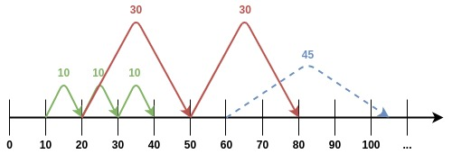

# Timed and DeferredEvent
{: .no_toc }

## Table of contents
{: .no_toc .text-delta }

- TOC
{:toc}

---

## [DES]{:target="_blank"}

The simulator follows the discrete-event simulation model. This means that the simulator models the operation of a system as a (discrete) **sequence of events in time**. 
This also entails that we can access the system only at specific points in time.

It is important to mention that systems using DES separate **real time** and **simulated time** thanks to their internal clocks.

This is also why no change in the system is assumed to occur between consecutive events; thus, the simulation time can **directly jump to** the occurrence time of **the next event**.  
This means that there can be instances where only seconds pass in real time, but the simulator's time models the system's actions years into the future.


---


## Tick

In these types of simulators and their libraries one of the most important concepts is the **smallest unit of time between two discrete events**.
This is usually milliseconds, seconds, or occasionally minutes.

DISSECT-CF and DISSECT-CF-Fog uses their **own DES model** rather than relying on another library. This approach is one of the simulators' greatest strengths,
allowing them to use virtually **any measurement** as their unit of time.

In these simulators we call this unit of time a **tick**.

{: .important}
Ticks can represent nanoseconds, months, even years, as long as everything (that is time-related) uses the **same measurement consistently**.  
In most examples, ticks can be thought of as **milliseconds** unless stated otherwise.


---


## Timed Events

In DISSECT-CF-Fog, there are **two types** of timed events: **Timed** and **DeferredEvent**. These can be used to control the simulations.

{: .important}
These events are executed only after they have **subscribed** to the simulator's internal clock.

Both Timed and DeferredEvent are abstract classes; therefore, if we want to use them to make events, we need to create our own classes by inheriting from them.
It is safe to say that anything **time-related** in your simulation will be a **descendant of these classes**, more on that later.

### [Timed]{:target="_blank"}

With **Timed** we can make **recurring** events.
This means a subscribed Timed event will occur at regular intervals until the simulation ends, or the event is unsubscribed.

For example, we can make a daemon-like service - such as a Garbage Collector - that runs every 5 minutes. 

Every event has a **freq** value, which represents the event's frequency. This is the time between the reoccurrence of the same events. 
This is the value we give to the **subscribe** function.

The actual actions that execute at these frequencies are defined in the [`tick`](#tick-1) function, which every class extending **Timed** should implement.

Here are some of the most important and commonly used functions of the Timed class:

#### `getFireCount`
{: .text-beta}

```java
public static long getFireCount(){...}
```

**Description:**  
Determines the simulated time that has already passed since the beginning of the simulation.

**Return:**
The number of ticks that has passed since the beginning of time.

---------------------------------------------------


#### `tick`
{: .text-beta}

```java
public abstract void tick(long fires);
```

**Description:**  
This function will be called on all timed objects which asked for a recurring event notification at a given time instance.

{: .note}
Every class that should receive timing events should extend this.

**Parameters:**
- `fires` – The particular time instance when the function was called. The time instance is passed so the
  tick functions will not need to call [getFireCount()](#getfirecount) if they need to operate on the actual time.


---------------------------------------------------


#### `subscribe`
{: .text-beta}

```java
protected final boolean subscribe(final long freq){...}
```

**Description:**  
Allows Timed objects to subscribe for recurring events with a particular frequency. 

{: .note}
This function is protected so no external entities should be able to modify the subscription for a timed object.

**Parameters:**  
- `freq` – the event frequency with which the [tick()](#tick-1) function should be called on the particular implementation of timed.

**Return:**
**True** if the subscription succeeded, **false** otherwise.

---------------------------------------------------


#### `unsubscribe`
{: .text-beta}

```java
protected final boolean unsubscribe(){...}
```

**Description:**  
Cancels the future recurrance of this event.

**Return:**
**True** if the unsubscription succeeded, **false** otherwise.


---------------------------------------------------


#### `simulateUntilLastEvent`
{: .text-beta}

```java
public static void simulateUntilLastEvent(){...}
```

**Description:**  
- Automatically advances the time in the simulation until there are no events remaining in the event queue.
- This function is useful when the simulation is completely set up and there is no user interaction expected before the simulation completes.
- The function is ensuring that all events are fired during its operation.

{: .warning}
Please note calling this function could lead to infinite loops if at least one of the timed objects in the system does not call its [unsubscribe()](#unsubscribe) function.

{: .note}
This will be one of the most important functions in these upcoming examples, since our goal is to make such "complete" simulations where this is the only thing left for us to do.
In case you need or want to do more manual simulations there are many functions in [Timed]{:target="_blank"} you should check out such as `jumpTime, skipEventsTill, simulateUntil, etc.`.


---


### [DeferredEvent]{:target="_blank"}

With **DeferredEvent** we can make **delayed**, one-time events.
This type of event is typically used when we want to trigger a one-time task after another event has occurred.

For example, once all files have arrived at the main repository, we can delete the local copies of those files.

DeferredEvents are defined by the **delay** value, which represents the time interval after the event is created until execution.
This is the value we give to the constructor.

Similar to the [`tick`](#tick-1) function in the Timed class, the actual behavior of a DeferredEvent is defined in the [`eventAction`](#eventaction) function.

Here are some of the most important and commonly used functions of the DeferredEvent class:

#### `DeferredEvent - constructor` 
{: .text-beta}

```java
public DeferredEvent(final long delay) {...}
```

**Description:**
The DeferredEvent class' constructor. Allows constructing objects that will receive an [eventAction()](#eventaction) call from Timed after `delay` ticks.

**Parameters:**
- `delay` – the number of ticks that should pass before this deferred event object's [eventAction()](#eventaction) will be called.

---------------------------------------------------

#### `eventAction`
{: .text-beta}

```java
protected abstract void eventAction();
```

**Description:**  
When creating a deferred event, implement this function for the actual event handling mechanism of yours.

---


## Examples

Let's look at some actual examples!

First a visual one.


{: .text-center}

In this image, there is a **timeline**. The red and green arrows are Timed events, while the blue arrow represents a DeferredEvent.
Of course, we could have any number of these events, but for visual clarity, we will stick to three.

Following the **green** arrows, we can see that the green Timed event has a frequency of 10 ticks and unsubscribes at 40.

The **red** arrow represents an event that recurs every 30 ticks and stops at 80.

If it is not clear yet, the **blue** arrow demonstrates clearly how DeferredEvents works: it is created at the 60-tick
mark with a 45 tick delay, and we see it execute right at 105, 45 ticks after 60.

---

**Now let's look at some code examples!**
{: .text-gamma}

### [Timed Example]{:target="_blank"}


```java
package hu.u_szeged.inf.fog.simulator.demo.simple;
import hu.mta.sztaki.lpds.cloud.simulator.Timed;

public class TimedExample extends Timed {

    String name;

    TimedExample(String name, long freq) {
        this.name = name;
        subscribe(freq);
    }

    @Override
    public void tick(long fires) {
        if (Timed.getFireCount() >= 300) {
           unsubscribe();
        }
        System.out.println(this.name + " - time: " + Timed.getFireCount());
    }

    public static void main(String[] args) {
        new TimedExample("TimedTest #1", 100);
        new TimedExample("TimedTest #2", 95);

        Timed.simulateUntilLastEvent();
    }
}
```

In this example program, we see a simple Timed event implementation.

Let's unpack what is actually happening here.

- There is a class extending Timed.
- There is a simple constructor that assigns a name to the event and [subscribes](#subscribe) it to the simulator's internal clock.
- The class overrides the original empty [tick](#tick-1) method, giving it behavior to execute every time it is triggered.
  - In [tick](#tick-1), we check the time elapsed since the start of the simulation using [getFireCount](#getfirecount). Once it exceeds 300 ticks, we unsubscribe the event.
  - There is also print statement, making it possible to observe the simulator in action. This allows us to see when the [tick](#tick-1) function is called.
- In the main method, we set up the actual simulation.
  - We create two instances of the previously defined class with different frequencies.
  - Finally, we can use the [simulateUntilLastEvent](#simulateuntillastevent) function to run the simulation.

If we run the program, the output should look like this:

```text
TimedTest #2 - time: 95
TimedTest #1 - time: 100
TimedTest #2 - time: 190
TimedTest #1 - time: 200
TimedTest #2 - time: 285
TimedTest #1 - time: 300
TimedTest #2 - time: 380

Process finished with exit code 0
```

Inspecting the output we can see that the first tick call happens right at tick 95 by TimedTest #2.  
After that the prints alternate between the two events. This demonstrates that the simulator's
internal clock works correctly and that events are triggered at the expected times.


{: .note}
In the example the `Timed.getFireCount()` calls could be replaced with the `fires` parameter of the `tick` method, since they represent the same value. It is used here mainly for clarity.

---

### [Deferred Example]{:target="_blank"}

In this example program, we see a simple DeferredEvent implementation that uses the previosly defined TimedExample class.

```java
package hu.u_szeged.inf.fog.simulator.demo.simple;
import hu.mta.sztaki.lpds.cloud.simulator.Timed;
import hu.mta.sztaki.lpds.cloud.simulator.DeferredEvent;

public class DeferredExample extends DeferredEvent {

    public DeferredExample(long delay) {
        super(delay);
    }

    @Override
    protected void eventAction() {
        new TimedExample("TimedTest #2", 25);
    }

public static void main(String[] args) {
        new TimedExample("TimedTest #1", 100);
        new DeferredExample(200);

        Timed.simulateUntilLastEvent();
    }
}
```

This example is not very different from the previous one.

- There is a class extending DeferredEvent.
- There is a simple constructor that calls the [parent's constructor](#deferredevent---constructor) using super, initializing the delay value.
- The class overrides the original empty [eventAction](#eventaction) method, giving it behavior.
  - In [eventAction](#eventaction), we create an instance of the previously defined TimedExample class.
- In the main method, we set up the actual simulation.
  - We create two instances: one TimedExample (as in the previous example) and one DeferredExample with a delay of 200 ticks.
  - Finally, we can use the [simulateUntilLastEvent](#simulateuntillastevent) function to run the simulation.

If we run the program, the output should look like this:

```text
TimedTest #1 - time: 100
TimedTest #1 - time: 200
TimedTest #2 - time: 225
TimedTest #2 - time: 250
TimedTest #2 - time: 275
TimedTest #1 - time: 300
TimedTest #2 - time: 300

Process finished with exit code 0
```

Inspecting the output we can see that TimedTest #1, which was created in main with a frequency of 100 ticks, runs before the one with 25 frequency.  
TimedTest #2 only writes to the console once the simulation is past 200 ticks (at 225), since this is
when the DeferredEvent triggers, followed by the 25-tick frequency of the TimedExample.  

---


After this section, you should now be familiar with the basic event types and how a DES-based simulator works.

[DES]: https://en.wikipedia.org/wiki/Discrete-event_simulation
[Timed]: https://github.com/sed-inf-u-szeged/DISSECT-CF-Fog/blob/master/simulator/src/main/java/hu/mta/sztaki/lpds/cloud/simulator/Timed.java
[DeferredEvent]: https://github.com/sed-inf-u-szeged/DISSECT-CF-Fog/blob/master/simulator/src/main/java/hu/mta/sztaki/lpds/cloud/simulator/DeferredEvent.java
[Timed Example]: https://github.com/sed-inf-u-szeged/DISSECT-CF-Fog/blob/master/simulator/src/main/java/hu/u_szeged/inf/fog/simulator/demo/simple/TimedExample.java
[Deferred Example]: https://github.com/sed-inf-u-szeged/DISSECT-CF-Fog/blob/master/simulator/src/main/java/hu/u_szeged/inf/fog/simulator/demo/simple/DeferredExample.java