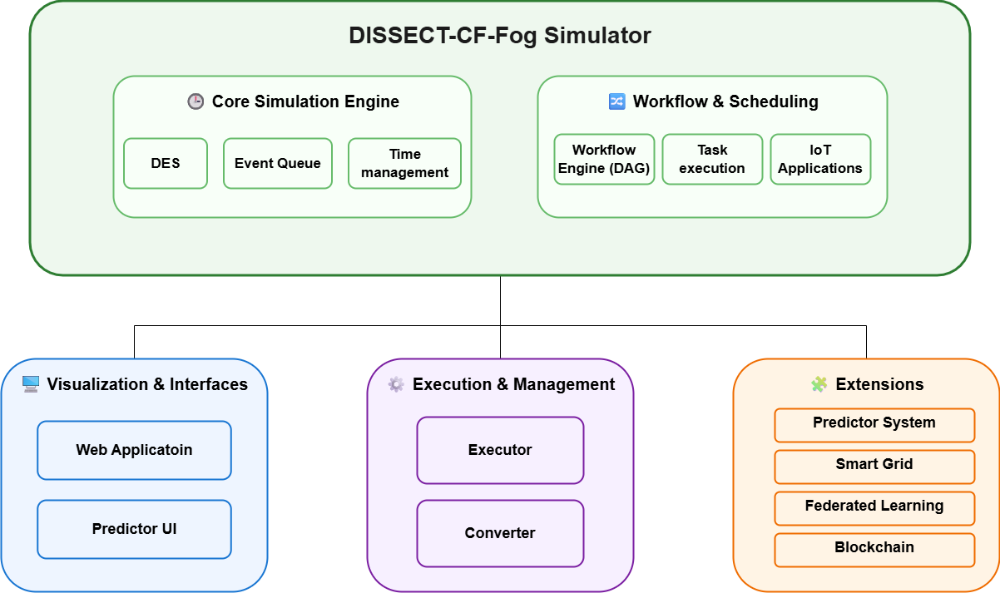

# DISSECT-CF-Fog Simulator Tutorial

---

## **Welcome!**

This site provides an introductory tutorial for the **[DISSECT-CF-Fog Simulator]{:target="_blank"}** — a modular simulation framework for modeling **IoT–Fog–Cloud systems**.

The simulator allows you to experiment with:

* distributed infrastructures (cloud, fog, IoT devices)
* application workflows and task scheduling
* resource usage, cost, and energy consumption
* advanced research extensions (prediction, smart grid, federated learning, etc.)

---

## **How the system is structured**

At a high level, the simulator is built around a **core simulation engine**, surrounded by tools and extensions:

{: .text-center}

### Core idea

* The **Simulator Core** runs the actual simulation
* Other modules either:
    * **control it** (WebApp, Executor)
    * **extend it** (Workflow, Predictor, Energy, etc.)
    * or **visualize/transform data** (UI, Converter)

---

## **Main components**

* **[Simulator]** – the core engine (execution, scheduling, infrastructure modeling)
* **[Web Application]** – user interface to configure and run simulations
* **[Executor]** – loads and executes configurations created by the web application module
* **[Predictor UI]** – visualizes and configures prediction models
* **[Converter]** – utility tool to transform simple scenarios to simulations in DISSECT-CF-Fog

---

## **Extensions (research features)**

The simulator is designed to be extensible. Some notable extensions include:

* **Workflow model** – executes applications as DAGs (task graphs)
* **Predictor system** – estimates future node load for better scheduling
* **Smart Grid extension** – models energy sources (including renewables)
* **Federated Learning module** – distributed machine learning across nodes
* **Blockchain extension** – decentralized coordination and trust modeling

---

## **About this tutorial**

This tutorial focuses on helping you **get started quickly**:

{: .important }
>
* Not every class is covered — mainly those used in the demos
* Only essential methods are explained
* For full details, refer to the Javadoc documentation

You’ll first learn the **key components**, then follow **hands-on demos**.

---

## [Let's get started!](setup)

---

[DISSECT-CF-Fog Simulator]: https://github.com/sed-inf-u-szeged/DISSECT-CF-Fog/tree/master/simulator
[demos]: https://github.com/sed-inf-u-szeged/DISSECT-CF-Fog/tree/master/simulator/src/main/java/hu/u_szeged/inf/fog/simulator/demo

[Simulator]: https://github.com/sed-inf-u-szeged/DISSECT-CF-Fog/tree/master/simulator
[Web Application]: https://github.com/andrasmarkus/DISSECT-CF-Fog-WebApp
[Executor]: https://github.com/sed-inf-u-szeged/DISSECT-CF-Fog/tree/master/executor
[Predictor UI]: https://github.com/sed-inf-u-szeged/DISSECT-CF-Fog/tree/master/predictor-ui
[Converter]: https://github.com/andrasmarkus/Convert-To-DISSECT-CF-Fog