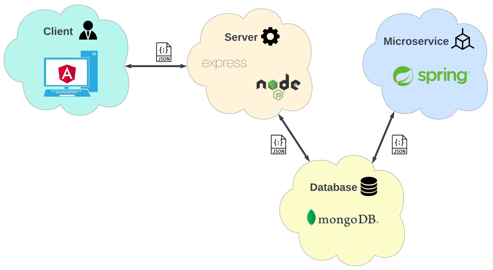

# DISSECT-CF-Fog

DISSECT-CF-Fog is based on [DISSECT-CF](https://github.com/kecskemeti/dissect-cf), and a direct extension of the DISSECT-CF-IoT simulator, written in Java programming language. 
The purpose of this simulator extension is to model fog devices and nodes, thus it is also able to model IoT-Fog-Cloud systems. 
The main benefit of this fog extension is offers the possibility of detailed configuration settings through XML configuration files, 
and it requires only minimal programming knowledge for define additional scenarios.  
The network operations, such as bandwidth, latency simulations and file transfers between the physical components are supported by its core simulator.
To create a physical topology, any horizontal and vertical connections are allowed, but in this web application,
the vertical communication supports only upward direction. 
The IoT layer provides the management of smart devices and those sensors with the abilities of simulating sensor measurement time, 
data generation frequency with size configuration.
Its application management layer handles the VMs and pairs the compute tasks (generated based on the received amount of data) to the VMs. 
The cost module is responsible for evaluating pricing methods, capable of calculating both dynamic cloud and IoT side costs based on real provider schemes.
Finally, the logical data-flow are defined by the physical topology by default for simplicity.

The main goal of this web application is to get to know the basic functionalities of the DISSECT-CF-Fog, 
create own fog topologies with IoT devices and sensors and execute scenarios using the predefinded strategies. For more detailed configuration options,
we encurage you to use the desktop version of the simulator.

For any inquiries please contact us by email to: **markusa (at) inf.u-szeged.hu**, or take a look what else we deal in the 
[IoT Cloud Research Group](http://iotcloud.sed.hu/) at the Software Engineering Department of the Institute of Informatics of the University of Szeged, Hungary.

# DISSECT-CF-Fog-WebApp

DISSECT-CF-Fog-WebApp is a full stack web application that will make the DISSECT-CF-Fog application available online. Registered users can run simulations in a more convenient configuration interface.
This allows the user to easily decide which strategy leads to the best simulation results. They can view the results of the simulations, including a diagram depicting the task schedule, node and device energy diagrams and the logged partial results.It is possible to run the same simulation with multiple application and device strategies within a configuration. The users can compare the results of simulations of different strategies using diagrams. The result and comparison diagrams and configuration files can also be downloaded for further use. It is also possible to view the results of previous simulations.
The backend part of the application is a Spring microservice which executes the DISSECT-CF-Fog Java application with the generated XML's that the users have configured on the web application interface. The client is built in Angular framework, while the server is built using Node.js. The server uses a MongoDB NoSQL database to store the configurations submitted by the users. The DISSECT-CF-Fog Spring microservice reads the configurations from this database and saves the results of the simulations to it.

### Setup Guide

TODO!!