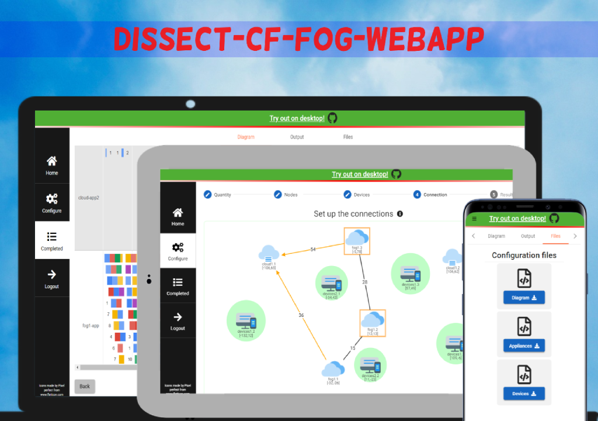

# DISSECT-CF-Fog-WebApp: Client

This project was generated with [Angular CLI](https://github.com/angular/angular-cli) version 9.0.1.
The client part of the web application communicates with the user and the server. The client is an online interface where the user can create a configuration and view their previous configurations. The client initiates REST API calls to the server, which include authentication and configuration calls and their additional data.
The design is created with Angular Material framework. The JointJs community library was used to visualize the configured topology. It is a SPA and responsive application.

## Running application

Run `ng serve` for a developement.  
For deploying the application run the `npm run start-prod` command. It will build the application in production and the app will run on 80 port with 0.0.0.0 host.