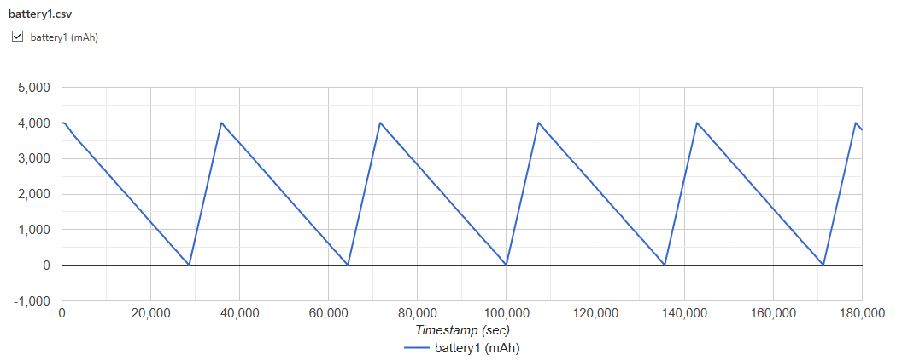
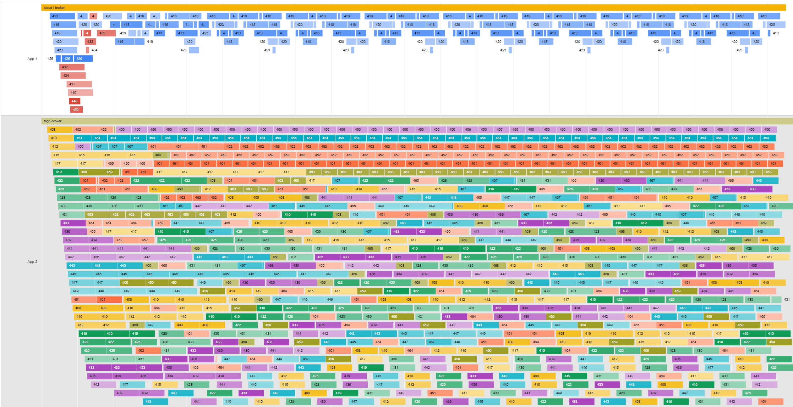
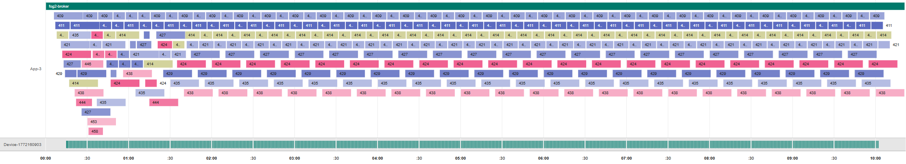

# Utilities
{: .no_toc }

## Table of contents
{: .no_toc .text-delta }

- TOC
{:toc}

---

The simulator both works with and generates a lot of data. To make it easier to use, see and compare them 
there a lot of helper classes that make reading, logging and visualizing them.

There are also other utility classes as well that makes it easier to manage or build the simulations.

These classes are found in the [util] folder of the simulator.

## Visualisers

### [AgentVisualiser]

The [AgentVisualiser] is a helper class for visualising CSV files as line graphs.

The CSV file structure should be like this:
- header line: X-axis, Y-axis
  - in the example it looks like: Timestamp (sec),battery0 (mAh)
- the data logs we want to visualize, following the same X-axis value, Y-axis value format
  - like this: 
	- 0,4000.0
	- 60,4000.0
	- 120,3998.8 
	- ...  

**Example:**

{: .text-center}

---

### [MapVisualiser]

The [MapVisualiser] helps visualise clouds, fog and devices on a map during the simulation.
The map shows:
- the cloud and fog node's range and latency between them.
- the device's movement range and the path they moved on during the simulation.

**Example:** 

{: .text-center}

---

### [TimelineVisualiser]

The [TimelineVisualiser] Provides functionality to generate a timeline visualization that presents main simulation events.
More specifically it visualises the timeline entries the devices and clouds (and applications on them) create - these are mostly VirtualMachine's lifetime.

**Example:**

{: .text-center}

{: .text-center}

---

## Nonvisual utility classes

### [SimRandom]

The [SimRandom] class acts like a singleton and allows you to define a random seed before creating events.
By centralizing all randomness through a single random number generator (RNG), every stochastic operation - such as sampling,
noise injection, or simulated failures — becomes reproducible and consistent across simulation runs.
This makes debugging, testing, and comparing results much easier, so its use is strongly recommended when building simulations.

---

### [EnergyDataCollector]

The [EnergyDataCollector] makes it possible to measure the consumption of PhysicalMachines (Devices) and IaaSServices (clouds) during simulations.
It also has an option of saving these consumptions into a file `energy.csv` where every monitored instance will be stored to compare values.

---

[util]: https://github.com/sed-inf-u-szeged/DISSECT-CF-Fog/tree/master/simulator/src/main/java/hu/u_szeged/inf/fog/simulator/util
[AgentVisualiser]: https://github.com/sed-inf-u-szeged/DISSECT-CF-Fog/blob/master/simulator/src/main/java/hu/u_szeged/inf/fog/simulator/util/AgentVisualiser.java
[MapVisualiser]: https://github.com/sed-inf-u-szeged/DISSECT-CF-Fog/blob/master/simulator/src/main/java/hu/u_szeged/inf/fog/simulator/util/MapVisualiser.java
[TimelineVisualiser]: https://github.com/sed-inf-u-szeged/DISSECT-CF-Fog/blob/master/simulator/src/main/java/hu/u_szeged/inf/fog/simulator/util/TimelineVisualiser.java
[SimRandom]: https://github.com/sed-inf-u-szeged/DISSECT-CF-Fog/blob/master/simulator/src/main/java/hu/u_szeged/inf/fog/simulator/util/SimRandom.java
[EnergyDataCollector]: https://github.com/sed-inf-u-szeged/DISSECT-CF-Fog/blob/master/simulator/src/main/java/hu/u_szeged/inf/fog/simulator/util/EnergyDataCollector.java
